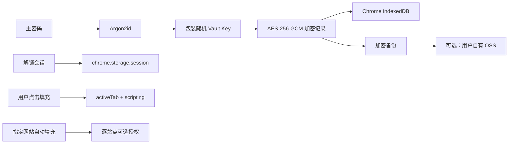

<div align="center">
  
  <h1>DIYVM Local Passkey</h1>
  <p>本地优先、可选用户自有 OSS 加密备份的密码与通行密钥管理器。</p>
  <p>
    
    
    
  </p>
  <p>
    <a href="./README_EN.md">English</a> ·
    <a href="./CHANGELOG.md">更新记录</a> ·
    <a href="./docs/privacy-policy.md">隐私政策</a> ·
    <a href="./docs/security-boundary.md">安全边界</a> ·
    <a href="./docs/chrome-web-store-listing-zh.md">商店提交文案</a>
  </p>
</div>

## 这是什么

DIYVM Local Passkey `1.2.1` 是一款面向通用网站的本地密码与通行密钥保险库。
扩展不需要 DIYVM 账户或开发者服务器；密码、通行密钥私钥和操作
记录均先加密，再保存到浏览器本地。用户也可以选择把完整加密备份手动上传到自己的
阿里云 OSS。

原 `0.4.x` 保险库会在首次成功解锁时自动迁移密钥派生元数据，已有通行密钥无需重建。

## 主要功能

- 在同一个加密保险库中管理密码和 ES256 通行密钥。
- 用户可主动授权在所有 HTTPS 网站处理普通 WebAuthn 通行密钥创建和登录；安装时
  不会获得任何网站权限。
- 当前 HTTP/HTTPS 页面可由用户点击后保存、匹配并填充密码，不自动提交表单。
- 优先识别当前登录弹窗，并支持同源 iframe、开放式 Shadow DOM 和分步登录。
- 可为指定 HTTPS 网站单独授权持续自动填充；默认不获取任意网站的长期访问权限。
- HTTP 网站仅支持逐次确认后的手动保存和填充，不允许持续自动填充。
- 新建、编辑、搜索、收藏、标签、备注、别名、回收站与恢复。
- 可配置密码生成器，并在本地检查弱密码、重复密码和长期未更新密码。
- 5 分钟至 24 小时自动锁定；关闭浏览器会丢弃会话密钥。
- 加密备份、备份结构校验、完整恢复与主密码修改。
- 可选用户自有阿里云 OSS 手动加密备份，不经过 DIYVM 服务器。
- 加密的本地操作日志，不含明文密码。

## 安全设计



- 新保险库使用 Argon2id（19 MiB、2 次迭代、并行度 1）派生包装密钥。
- 每条密码、通行密钥与审计记录使用 AES-256-GCM 独立加密。
- 主密码不保存；解锁后的 Vault Key 仅放在浏览器会话存储中，并受自动锁定限制。
- 密码只对完全相同的 HTTP/HTTPS Origin 匹配；HTTP 与 HTTPS 不互通。扩展不会点击
  登录按钮或自动提交，HTTP 填充前会再次警告连接未加密。
- 通行密钥页面桥接仅用于已授权的 HTTPS 顶层页面，并验证实际发送方 Origin、RP ID
  与公共后缀；用户拒绝本地方式或参数不受支持时回退 Chrome/系统验证器。
- 扩展不加载远程 JavaScript、Wasm 或配置代码。

详细威胁模型和限制见[安全边界](./docs/security-boundary.md)。

## 权限说明

| 权限 | 用途 |
| --- | --- |
| `storage` | 保存非敏感设置和临时解锁会话 |
| `activeTab` | 用户点击扩展后读取或填充当前标签页的登录表单 |
| `scripting` | 在当前标签页执行一次性捕获/填充，并注册用户授权站点的脚本 |
| `alarms` | 到达用户设置的时间后自动锁定保险库 |
| HTTPS 主机权限（可选） | 用于用户主动开启通用 Passkey、精确 Origin 自动填充，或连接自己的 OSS Bucket，可随时撤销 |

点击式填充不需要授予网站长期权限。清单中的 `https://*/*` 是可选能力：默认不申请
全部网站；只有用户明确开启“通用 Passkey”时才请求全站权限。
精确网站自动填充和 OSS 仍按单个 Origin/Bucket 授权。

## 本地开发

要求 Node.js 20+ 和 Chrome 120+。

```bash
npm ci
npm run test:pure
```

开发构建输出到 `extension/dist/`。在 `chrome://extensions` 开启开发者模式，选择
“加载已解压的扩展程序”，然后选择该目录。

正式商店构建不包含 source map：

```bash
npm run build:store
```

## 使用流程

1. 打开扩展并设置主密码，或用原主密码解锁已有保险库。
2. 在“密码”中手动添加，或在 HTTP/HTTPS 网站打开登录表单后点击“读取当前表单”。
3. 默认通过“填充当前页面”完成一次性填充；HTTP 页面会逐次显示风险确认。只有 HTTPS
   网站可以按精确 Origin 开启自动填充。
4. 可选：在“设置”中主动开启所有 HTTPS 网站的 Passkey 权限；拒绝本地方式时会改用
   Chrome/系统验证器，关闭开关会移除全站脚本并撤销全站权限。
5. 定期导出加密备份，并使用“验证备份”确认文件可读取。
6. 可选：在“设置”中连接用户自有阿里云 OSS，手动上传、检查或恢复加密备份。

## 1.2.1 的边界

- 不提供多设备双向实时同步、共享保险库、支付卡或身份资料自动填充。
- 软件通行密钥的隔离强度低于 TPM、Secure Enclave 或独立硬件安全密钥。
- 密码填入网页后，该网页自身的脚本可能读取输入框内容；只应在可信、域名正确的网站填充。
- 本项目完成了自动化测试和代码级安全检查，但不宣称已通过独立第三方安全审计。
- Chrome Web Store 中已经发布的旧版本与本仓库的 `1.2.1` 更新是不同审核批次；提交更新后
  仍需等待 Google 审核。

## 数据与隐私

扩展不收集遥测、不展示广告、不出售数据，也不向 DIYVM 服务器发送保险库。只有用户
明确启用 OSS 功能时，完整加密备份才会发送到用户配置的阿里云 OSS。卸载扩展会删除
Chrome 管理的本地扩展数据，但不会删除磁盘或 OSS 中的备份。完整说明见
[隐私政策](./docs/privacy-policy.md)。

## 开源许可

[Apache License 2.0](./LICENSE)
