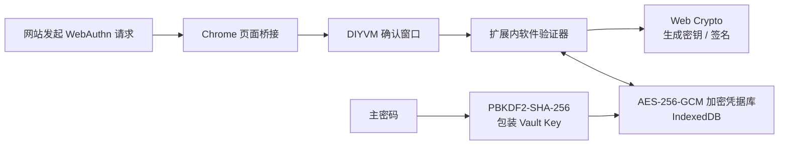

<div align="center">
  <a href="https://www.diyvm.com">
    
  </a>

  <h1>DIYVM Local Passkey</h1>

  <p>
    <strong>完全运行在 Chrome 扩展内的本地通行密钥管理器</strong>
  </p>

  <p>
    无本机服务 · 无 Native Messaging · 无云端凭据同步
  </p>

  <p>
    <a href="https://github.com/DIYVM/DIYVM-local-passkey/actions/workflows/build-extension.yml">
      
    </a>
    
    
    
    <a href="./LICENSE">
      
    </a>
  </p>

  <p>
    <a href="https://www.diyvm.com">官方网站</a>
    ·
    <a href="https://github.com/DIYVM/DIYVM-local-passkey/releases/latest">下载最新版</a>
    ·
    <a href="./docs/security-boundary.md">安全边界</a>
  </p>
</div>

---

DIYVM Local Passkey `0.3.0` 是一个 Manifest V3 纯 Chrome 插件。通行密钥的生成、
签名、加密和存储均在扩展内部完成，不需要安装 `PasskeyHost.exe`，也不申请
`nativeMessaging` 或 `webAuthenticationProxy` 权限。

> [!IMPORTANT]
> 当前版本用于测试和兼容性验证，尚未经过外部安全审计或 Chrome Web Store 审核。
> 请只使用可恢复的测试账户，并始终保留密码、OTP 或其他安全密钥。

## 核心能力

| 能力 | 实现 |
| --- | --- |
| 本地通行密钥 | 使用 Web Crypto 为每枚凭据生成独立的 ES256 / P-256 密钥 |
| 加密凭据库 | 私钥、RP ID、账户信息和计数器使用 AES-256-GCM 加密后存入 IndexedDB |
| 主密码保护 | PBKDF2-SHA-256（600,000 次迭代）用于包装随机 256 位 Vault Key |
| 会话锁定 | Vault Key 只进入 `chrome.storage.session`，可手动锁定，并在 Chrome 重启或插件更新、重载时清除 |
| 操作确认 | 每次注册或登录均显示独立确认窗口，可使用本地通行密钥、改用系统验证器或取消 |
| 数据迁移 | 支持加密凭据库导出与原子导入，恢复时仍需原主密码 |
| 自适应界面 | 自动跟随系统深浅色模式，采用 DIYVM 官网视觉风格 |
| 最小权限 | 仅申请 `storage` 权限，页面访问范围限制在受支持的 HTTPS 站点 |

插件不会读取或复制 Windows Hello、Chrome 密码管理器、USB 安全密钥或其他
验证器中的私钥。

## 工作原理



页面桥接只处理白名单站点的顶层、非条件式 WebAuthn 请求。选择“改用 Chrome /
系统验证器”时，请求会返回浏览器原生实现。

## 兼容范围

| 项目 | 当前状态 |
| --- | --- |
| Chrome | `120` 及以上 |
| 扩展规范 | Manifest V3 |
| `webauthn.io` | 自动测试覆盖注册、登录和签名验证 |
| `amazon.com` 及其 HTTPS 子域 | 真实账户已人工验证通行密钥创建和登录；尚未纳入自动化测试 |
| 条件式 WebAuthn | 不拦截，继续使用 Chrome 原生实现 |
| 算法 | 当前仅支持 ES256 |

纯插件不依赖 Windows 可执行文件，但当前仍未完成跨操作系统和 Windows 实机矩阵
验证。

## 安装测试版

### 从 GitHub Releases 下载

1. 打开项目的 [最新 Release](https://github.com/DIYVM/DIYVM-local-passkey/releases/latest)。
2. 下载 `DIYVM-Local-Passkey-Chrome-0.3.0.zip`。
3. 可使用同一 Release 中的 `.sha256` 文件校验下载完整性。
4. 解压扩展 ZIP。
5. 在 Chrome 打开 `chrome://extensions` 并开启“开发者模式”。
6. 点击“加载已解压的扩展程序”，选择包含 `manifest.json` 的目录。

### 从源码构建

需要 Node.js `20` 或更高版本：

```bash
git clone https://github.com/DIYVM/DIYVM-local-passkey.git
cd DIYVM-local-passkey
npm ci
npm run test:pure
```

构建结果位于 `extension/dist`。在 `chrome://extensions` 中加载该目录即可。

## 快速开始

1. 点击 Chrome 工具栏中的 DIYVM Local Passkey 图标。
2. 创建至少 `12` 个 UTF-8 字节的主密码。
3. 打开 [webauthn.io](https://webauthn.io)，输入测试用户名并注册通行密钥。
4. 在 DIYVM 确认窗口中选择“使用本地通行密钥”。
5. 使用刚创建的凭据完成登录验证。

忘记主密码后无法恢复本地凭据。请在正式迁移或重装系统前先导出加密备份。

## 备份与恢复

插件页面中的“导出备份”会生成：

```text
DIYVM-LocalPasskey-backup-<时间>.diyvmpasskey.json
```

备份包含 KDF 参数、包装后的 Vault Key 和 IndexedDB 加密记录，不包含明文 RP ID、
账户名或私钥。导入时会先验证文件大小、版本、结构和 SHA-256，再通过单个
IndexedDB 事务完整替换当前凭据库；验证失败不会覆盖现有数据。

> [!WARNING]
> 备份文件可以被离线猜测主密码。请使用高强度主密码，将备份保存在可信的加密
> 存储中，并避免通过公开渠道传输。

## 开发与验证

```bash
# TypeScript 类型检查
npm run check

# 运行 16 项本地自动测试
npm test

# 构建 Chrome 扩展
npm run build

# 一次完成检查、测试和构建
npm run test:pure
```

如需复测 webauthn.io 当前服务端，可运行：

```bash
npm run test:webauthn-io
```

该命令使用一次性用户名完成真实注册和登录验签，不访问 Amazon，也不在 GitHub
Actions 中自动运行。

自动测试覆盖 IndexedDB 加密读写与原子恢复、主密码锁定与解锁、ES256 注册和
登录、attestation 与 COSE 公钥、签名计数器、加密备份恢复、RP ID 边界、消息
校验以及 Manifest 权限约束。

## 发布流程

`main` 分支的每次推送和拉取请求都会执行检查、测试、构建，并保存一个保留
30 天的 Actions Artifact。正式版本通过与 `extension/package.json` 版本一致的
Git 标签发布：

```bash
git tag v0.3.0
git push origin v0.3.0
```

标签构建通过后，GitHub Actions 会自动创建对应 Release，并上传扩展 ZIP 和
SHA-256 校验文件。Release 页面自动生成的 `Source code (zip)` 是源码快照，不是
可安装的 Chrome 扩展包。

## 项目结构

```text
.
├── .github/workflows/       # 自动检查、测试和安装包构建
├── docs/                    # 开发、协议与安全说明
├── extension/
│   ├── icons/               # Chrome 扩展图标
│   ├── scripts/             # 构建和在线验证脚本
│   ├── src/                 # 扩展、软件验证器与加密凭据库源码
│   └── test/                # 自动测试
├── LICENSE
└── package.json
```

仓库仅保留纯 Chrome 插件实现，不包含本机宿主、Native Messaging、Windows
安装器或其他历史版本源码。

## 文档

- [开发说明](./docs/development.md)
- [页面桥接协议](./docs/protocol.md)
- [安全边界与已知限制](./docs/security-boundary.md)

## 许可证

本项目基于 [Apache License 2.0](./LICENSE) 开源。

<div align="center">
  <sub>
    Built by <a href="https://www.diyvm.com">DIYVM</a>
  </sub>
</div>
