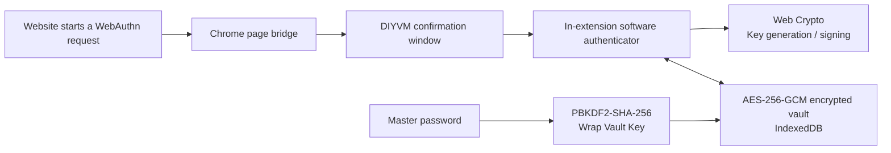

<div align="center">
  <a href="https://www.diyvm.com">
    
  </a>

  <h1>DIYVM Local Passkey</h1>

  <p>
    <strong>A local passkey manager that runs entirely inside a Chrome extension</strong>
  </p>

  <p>
    No native service · No Native Messaging · No cloud credential sync
  </p>

  <p>
    <a href="https://github.com/DIYVM/DIYVM-local-passkey/actions/workflows/build-extension.yml">
      
    </a>
    
    
    
    <a href="./LICENSE">
      
    </a>
  </p>

  <p>
    <a href="./README.md">简体中文</a>
    ·
    <strong>English</strong>
  </p>

  <p>
    <a href="https://www.diyvm.com">Official Website</a>
    ·
    <a href="https://github.com/DIYVM/DIYVM-local-passkey/releases/latest">Download Latest Release</a>
    ·
    <a href="./docs/security-boundary.md">Security Boundary</a>
  </p>
</div>

---

DIYVM Local Passkey `0.3.0` is a pure Manifest V3 Chrome extension. Passkey
generation, signing, encryption, and storage all happen inside the extension.
It does not require `PasskeyHost.exe` and does not request the
`nativeMessaging` or `webAuthenticationProxy` permissions.

> [!IMPORTANT]
> This version is intended for testing and compatibility validation. It has
> not yet undergone an external security audit or Chrome Web Store review.
> Use only recoverable test accounts and always retain a password, OTP, or
> another security key.

## Core Capabilities

| Capability | Implementation |
| --- | --- |
| Local passkeys | Generates an independent ES256 / P-256 key pair for every credential with Web Crypto |
| Encrypted vault | Encrypts private keys, RP IDs, account information, and counters with AES-256-GCM before storing them in IndexedDB |
| Master password protection | Uses PBKDF2-SHA-256 with 600,000 iterations to wrap a random 256-bit Vault Key |
| Session locking | Keeps the Vault Key only in `chrome.storage.session`; users can lock manually, and Chrome clears it on browser restart or extension update/reload |
| Operation confirmation | Shows a separate confirmation window for every registration or sign-in, with options to use the local passkey, switch to the system authenticator, or cancel |
| Data migration | Supports encrypted vault export and atomic import; restoring a vault still requires its original master password |
| Adaptive interface | Follows the system light/dark preference and uses the DIYVM website visual style |
| Minimal permissions | Requests only `storage` and limits page access to supported HTTPS sites |

The extension does not read or copy private keys from Windows Hello, Chrome
Password Manager, USB security keys, or any other authenticator.

## How It Works



The page bridge handles only top-level, non-conditional WebAuthn requests on
allowlisted sites. When the user selects **Use Chrome / system instead**, the
request falls back to the browser's native implementation.

## Compatibility

| Item | Current Status |
| --- | --- |
| Chrome | Version `120` or later |
| Extension platform | Manifest V3 |
| `webauthn.io` | Automated tests cover registration, sign-in, and signature verification |
| `amazon.com` and its HTTPS subdomains | Passkey creation and sign-in have been manually verified with a real account; not yet covered by automated tests |
| Conditional WebAuthn | Not intercepted; continues through Chrome's native implementation |
| Algorithm | ES256 only |

The pure extension does not depend on Windows executables, but cross-platform
and physical Windows test matrices have not yet been completed.

## Install the Test Build

### Download from GitHub Releases

1. Open the project's [latest Release](https://github.com/DIYVM/DIYVM-local-passkey/releases/latest).
2. Download `DIYVM-Local-Passkey-Chrome-0.3.0.zip`.
3. Optionally verify the download with the `.sha256` file from the same Release.
4. Extract the extension ZIP.
5. Open `chrome://extensions` and enable **Developer mode**.
6. Select **Load unpacked** and choose the directory containing `manifest.json`.

### Build from Source

Node.js `20` or later is required:

```bash
git clone https://github.com/DIYVM/DIYVM-local-passkey.git
cd DIYVM-local-passkey
npm ci
npm run test:pure
```

The build output is written to `extension/dist`. Load that directory from
`chrome://extensions`.

## Quick Start

1. Select the DIYVM Local Passkey icon in the Chrome toolbar.
2. Create a master password containing at least `12` UTF-8 bytes.
3. Open [webauthn.io](https://webauthn.io), enter a test username, and register a passkey.
4. Select **Use local passkey** in the DIYVM confirmation window.
5. Sign in with the credential you just created.

Local credentials cannot be recovered if the master password is lost. Export
an encrypted backup before migrating to another computer or reinstalling the
operating system.

## Backup and Restore

Selecting **Export backup** in the extension popup creates:

```text
DIYVM-LocalPasskey-backup-<timestamp>.diyvmpasskey.json
```

The backup contains KDF parameters, the wrapped Vault Key, and encrypted
IndexedDB records. It does not contain plaintext RP IDs, account names, or
private keys. Before importing, the extension validates the file size,
version, structure, and SHA-256 checksum. It then replaces the current vault
in a single IndexedDB transaction; failed validation leaves the existing vault
unchanged.

> [!WARNING]
> An attacker with the backup file can attempt to guess its master password
> offline. Use a strong master password, keep backups in trusted encrypted
> storage, and do not transfer them through public channels.

## Development and Verification

```bash
# Type-check the TypeScript source
npm run check

# Run all 16 local automated tests
npm test

# Build the Chrome extension
npm run build

# Type-check, test, and build in one command
npm run test:pure
```

To retest the live webauthn.io service, run:

```bash
npm run test:webauthn-io
```

This command uses a one-time username to perform a real registration and
sign-in verification. It does not access Amazon and is not executed
automatically in GitHub Actions.

Automated tests cover encrypted IndexedDB reads and writes, atomic restore,
master password locking and unlocking, ES256 registration and sign-in,
attestation and COSE public keys, signature counters, encrypted backup restore,
RP ID boundaries, message validation, and Manifest permission constraints.

## Release Process

Every push and pull request targeting `main` runs checks, tests, and a build,
then stores an Actions Artifact for 30 days. Formal versions are published from
Git tags that match the version in `extension/package.json`:

```bash
git tag v0.3.0
git push origin v0.3.0
```

After the tagged build passes, GitHub Actions automatically creates the
corresponding Release and uploads the extension ZIP and its SHA-256 checksum.
The automatically generated `Source code (zip)` on the Release page is a
source snapshot, not an installable Chrome extension package.

## Project Structure

```text
.
├── .github/workflows/       # Automated checks, tests, and package builds
├── docs/                    # Development, protocol, and security documentation
├── extension/
│   ├── icons/               # Chrome extension icons
│   ├── scripts/             # Build and live verification scripts
│   ├── src/                 # Extension, software authenticator, and encrypted vault source
│   └── test/                # Automated tests
├── LICENSE
└── package.json
```

The repository contains only the pure Chrome extension implementation. It does
not include a native host, Native Messaging integration, a Windows installer,
or source code from historical versions.

## Documentation

- [Development guide (Chinese)](./docs/development.md)
- [Page bridge protocol (Chinese)](./docs/protocol.md)
- [Security boundary and known limitations (Chinese)](./docs/security-boundary.md)

## License

This project is licensed under the
[Apache License 2.0](./LICENSE).

<div align="center">
  <sub>
    Built by <a href="https://www.diyvm.com">DIYVM</a>
  </sub>
</div>
